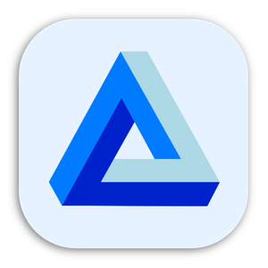
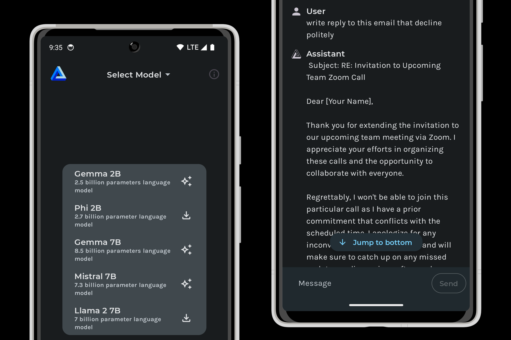

<h1 align="center">LM Playground</h1>

<p align="center">

</p>

LM Playground is designed as a universal platform for experimenting with various types of Large Language Models (LLMs) on Android device. It allows users to download different LLMs, load them onto the application, and converse with these models.



## Currently supported models
* Qwen2.5 0.5B
* Qwen2.5 1.5B
* Llama3.2 1B
* Llama3.2 3B
* Google Gemma2 2B
* Microsoft Phi3.5 mini
* Llama3.1 7B
* Mistral 7B
* Google Gemma2 9B

## Install
If you're just looking to install LM Playground, you can find it on [Google Play](https://play.google.com/store/apps/details?id=com.druk.lmplayground). If you're a developer wanting to contribute, read on.

## Build Instructions
Prerequisites:
* Android Studio: [2024.1.1+](https://developer.android.com/studio/releases)
* NDK: 26.2.11394342

1. Clone the repository:
```
git clone https://github.com/andriydruk/LMPlayground.git
```
2. Open the project in Android Studio: `File` > `Open` > Select the cloned repository.
3. Connect an Android device or start an emulator.
4. Run the application using `Run` > `Run 'app'` or the play button in Android Studio.

# License
This project is licensed under the [MIT License](LICENSE).

# Acknowledgments
This project was built based on [llama.cpp](https://github.com/ggerganov/llama.cpp) project. The application uses GGUF-format models with Q4KM quantization from [Hugging Face](https://huggingface.co/).

# Contact
If you have any questions, suggestions, or issues, feel free to open an issue or contact me directly at [me@andriydruk.com](mailto:me@andriydruk.com).


